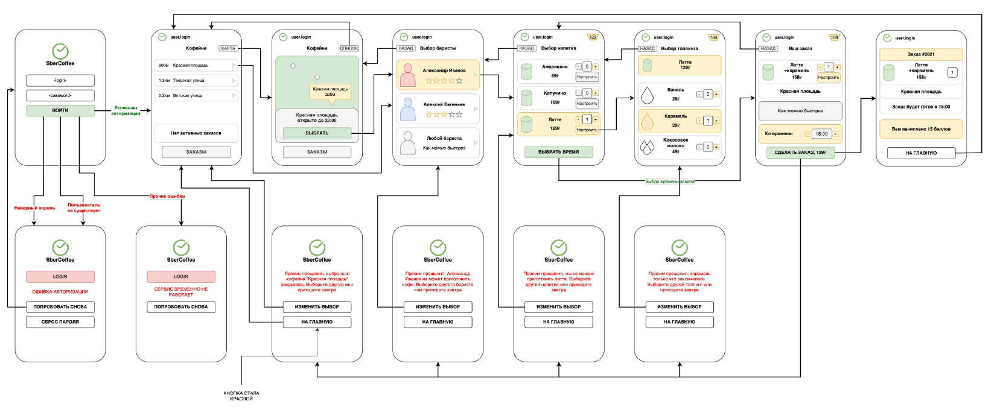
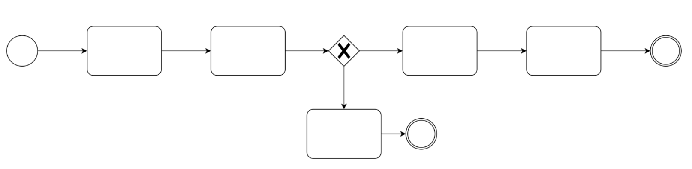
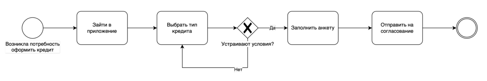
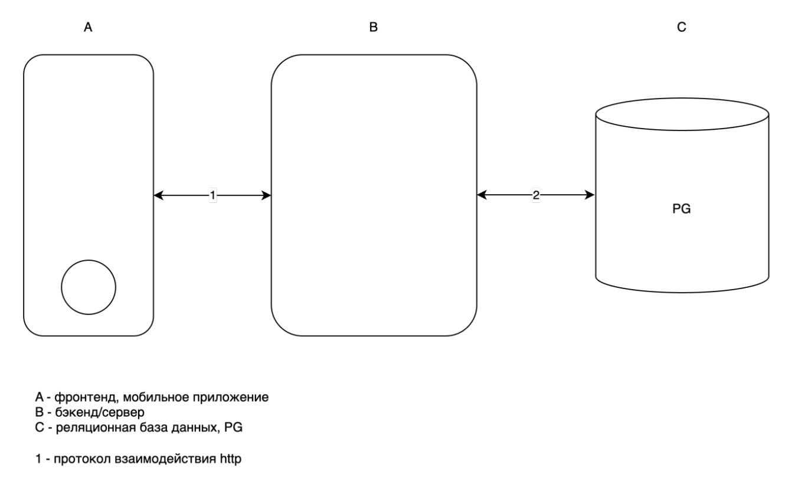
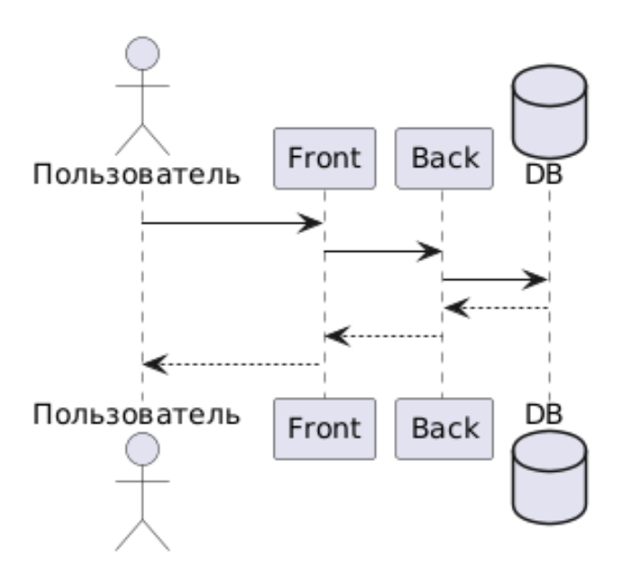
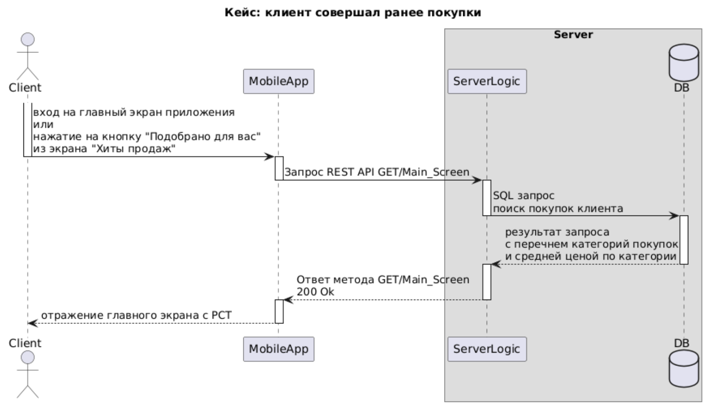
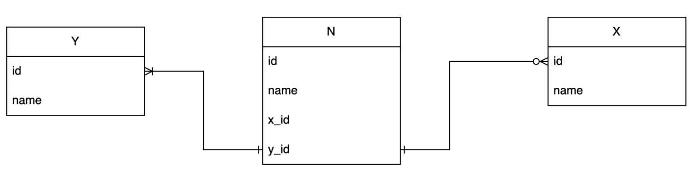
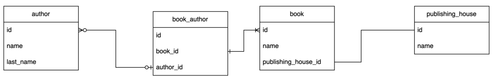
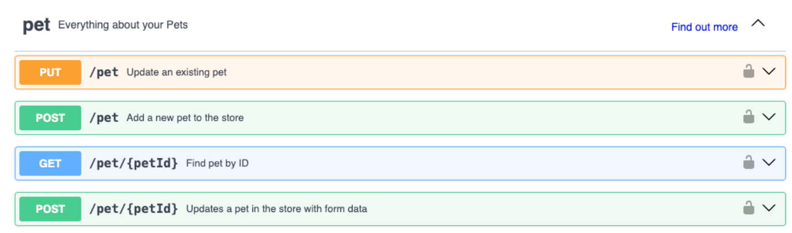
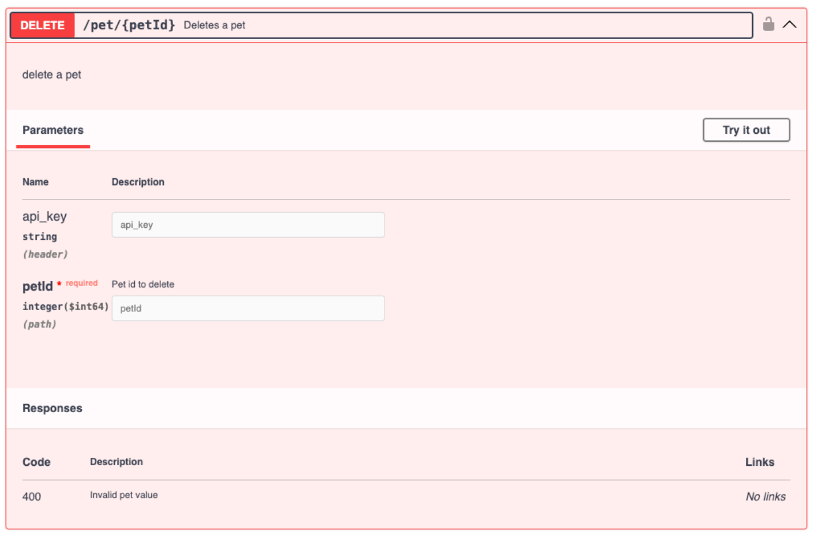

ШАБЛОН ТРЕБОВАНИЙ ПО БИЗНЕС-СИСТЕМНОМУ АНАЛИЗУ

## 1. Название продукта
Название продукта, в котором реализуется ваша фичи

## 2. User story
User story (пользовательская история) — это простой и короткий текст, который описывает
потребности и ожидания заказчика от продукта или услуги. Основная цель —понять, что именно
нужно создать, чтобы удовлетворить потребности конечного пользователя.
Формула составления US: кто + что + зачем.
#### Шаблон
Я, как [роль пользователя], хочу [действие/функциональность], чтобы [результат/цель]
Или представление в табличном виде:
| Кто | Потребность | Цель |
|----|------------|------|
| Я | КАК… | ХОЧУ… ЧТОБЫ… |
| Пример | | |
### Пример
Я, как клиент банка, хочу подать заявку на кредит через приложения банка, чтобы сократить
время на поход в банк.

## 3. Макеты
Макеты или прототипы системы нужны для того, чтобы дизайнер мог понять, что именно ему
необходимо изобразить, а также для того, чтобы понять пользовательский путь. В макете должно
быть схематично отображен будущий интерфейс со всеми основными элементами.
Пример

## 4. Use case
Use case (вариант использования) — это описание того, как пользователь взаимодействует с
системой, чтобы достичь определенной цели. Варианты использования помогают понять
требования к системе и то, как она будет работать в разных сценариях.
Для корректности составления необходимо опираться на согласованные макеты.
UС для удобства описываются с помощью таблицы. Такое же представление вы можете
встретить при описании сценариев после отображения use case диаграммы в UML.
#### Шаблон
| Заголовок | Оформление онлайн билета на самолет |
|-----------|------------------------------------|
| Акторы | |
| Предусловие | |
| Ограничения | |
| Триггер | |
| Основной сценарий | |
| Альтернативный сценарий | |
| Исключительный сценарий | |
#### Пример
| Заголовок | Оформление онлайн билета на самолет |
|-----------|------------------------------------|
| Акторы | Клиент |
| Предусловие | Клиент зарегистрирован и авторизован в приложении авиакомпании |
| Ограничения | Бронирование возможно не позднее 48 часов до вылета. Можно забронировать максимум 5 билетов за раз |
| Триггер | Клиент нажимает кнопку «Купить билет» |
| Основной сценарий | 1. Система отображает форму выбора рейса (экран 1). 2. Клиент выбирает рейс. 3. Система отображает экран ввода данных пассажиров (экран 2). 4. Клиент вводит данные. 5. Система отображает экран выбора мест (экран 3). 6. Клиент выбирает места и переходит к оплате. 7. Система отображает окно ввода данных карты (экран 4а). 8. Клиент вводит данные карты и завершает оплату. 9. Система подтверждает успешную покупку и отправляет электронный билет (экран 5). Критерий успеха: Билет успешно оформлен, клиент получил подтверждение. |
| Альтернативный сценарий | 8а. Клиент выбирает оплату по PayPal вместо банковской карты. 9а. Система отображает окно для оплаты по PayPal (экран 4б). 10а. Клиент вводит данные и завершает оплату. -- Переход к шагу 9 основного сценария. |
| Исключительный сценарий | 7б. Система сообщает, что места на рейсе закончились и предлагает выбрать другой рейс (экран 6). Результат: Покупка не состоялась, клиенту даны инструкции по дальнейшим действиям. |

## 5. BPMN
BPMN (Business Process Model and Notation) 2.0 — это стандартная нотация для
моделирования бизнес-процессов. Она предоставляет графический язык для описания процессов
организации, который понятен как бизнес-аналитикам, так и техническим специалистам. Основная
цель BPMN — сделать бизнес-процессы более прозрачными и понятными для всех
заинтересованных сторон, что упрощает их анализ и улучшение.
Для чего нужна BPMN 2.0:
• Унификация понимания
• Документация процессов
• Анализ и оптимизация процессов
• Автоматизация процессов
#### Шаблон

#### Пример

## 6. Архитектура
Фронтенд – это схематичный веб или мобильное приложение системы. Также фронтенд
называют клиентом
Бэкенд – это внутренний сервер системы проекта. Сервер обращается к базе данных с
полученными данными от клиента (фронтенда)
База данных – это хранилище данных, с которыми будет работать сервер
#### Пример

## 7. Диаграмма последовательности
Диаграмма последовательности — это тип UML-диаграммы, который используется для
моделирования взаимодействий между объектами в системе. Она отображает, в каком порядке и как
взаимодействуют между собой различные объекты или компоненты во времени. Основное
назначение — показать, как запросы и ответы передаются между элементами системы.
#### Шаблон

#### Пример

## 8. Модель данных
Модель данных – это представление данных, атрибутного состава сущностей, как сущности
связаны друг с другом.
####Шаблон
  Родительская сущность | Атрибут | Описание |
 |----------------------|---------|----------|
 | Сущность 1 | Атрибут 1 | Описание атрибута 1 |
 | Сущность 1 | Атрибут 2 | Описание атрибута 2 |
 | Сущность 2 | Атрибут 1 | Описание атрибута 1 |
 | Сущность 2 | Атрибут 2 | Описание атрибута 2 |
#### Пример
Объект User
  Родительская сущность | Атрибут | Описание |
 |----------------------|---------|----------|
 | User | | Объект пользователя, который имеет атрибуты и ссылки на другие объекты |
 | | FootSize | Размер ноги |
 | | Gender | Пол |
 | | WorkingAdress | Рабочий адрес. Ссылка на объект рабочий адрес. |
 | | WorkingPhone | Рабочий телефон. Ссылка на объект рабочий телефон. |
Объект WorkingAdress
| Родительская сущность | Атрибут | Описание |
|----------------------|---------|----------|
| WorkingAdress | | Объект рабочего адреса. |
| | StreetName | Название улицы. Например, "Ленина". |
| | HomeIndex | Номер дома. Например, "14". |
| | PostIndex | Почтовый индекс. Например, "644876". |

## 9. ERD-диаграмма
ERD-диаграмма — диаграмма где показано, как разные «сущности» (люди, объекты,
концепции и так далее) связаны между собой внутри системы.
Шаблон

Пример

## 10. REST. Табличный вид
REST API подход использует HTTP-методы (GET, POST, PUT, DELETE и т.д.) для управления
сущностями с уникальными URL.
Шаблон
#### Request
Название параметра | Тип данных | Описание | Обязательность параметра |
 |-------------------|------------|----------|--------------------------|
 |  |  |  |  |
#### Response
Название параметра | Тип данных | Описание | Обязательность параметра |
 |-------------------|------------|----------|--------------------------|
 |  |  |  |  |
#### Пример
Get /v1/credits/types/{typeId}
Получение типа кредита по идентификатору
#### Request
Название параметра | Тип данных | Описание | Обязательность параметра |
 |-------------------|------------|----------|--------------------------|
 | typeId | int | Уникальный идентификатор типа кредита | да |
#### Response
Название параметра | Тип данных | Описание | Обязательность параметра |
 |-------------------|------------|----------|--------------------------|
 | typeId | int | Уникальный идентификатор типа кредита | да |
 | name | string | Название типа кредита | да |
 | description | string | Описание типа кредита | нет |

## 11. Swagger
Swagger — это инструмент, который помогает разработчикам создавать, документировать и
проверять API.
Для чего нужен swagger системным аналитикам:
• Описание и проектирование API
• Согласование требований
• Создание документации
• Тестирование API
Пример

